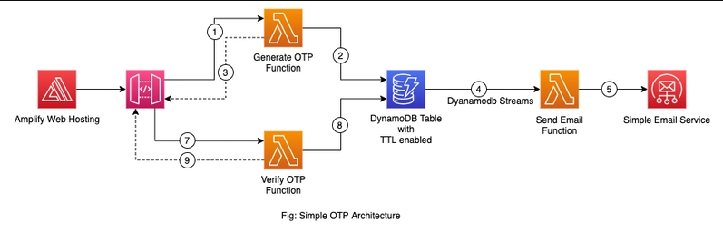

# 🔐 AWS Serverless OTP Authentication System

A fully serverless One-Time Password (OTP) authentication platform designed using AWS cloud-native services.  
This project demonstrates secure OTP generation, persistence, verification, and delivery via email — without managing servers.

---

## 📌 Overview

This system enables users to:

✔ Request an OTP using their email  
✔ Receive the OTP instantly via Amazon SES  
✔ Validate OTP through API  
✔ Automatically expire stored OTPs using DynamoDB TTL  

Built using a fully event-driven serverless architecture.

---

## 🧰 Tech Stack

| Category | Technology |
|---------|------------|
| Frontend | Vue.js |
| API Gateway | Amazon API Gateway |
| Compute | AWS Lambda |
| Database | Amazon DynamoDB (TTL Enabled) |
| Email Service | Amazon SES |
| IaC & Deployment | AWS Serverless Application Model (SAM) |
| Programming Runtime | Node.js |

---

## 🏗 Architecture

> Event-driven OTP system using Lambda, DynamoDB Streams, and SES.



---

## ⚙️ Flow Summary

1. User enters an email in the frontend UI.
2. Vue.js sends API call → `/otp/generate`
3. Lambda generates OTP, stores record in DynamoDB with expiry.
4. DynamoDB Stream triggers another Lambda.
5. Lambda sends OTP email using Amazon SES.
6. User enters OTP → `/otp/verify`
7. Verification Lambda validates OTP and returns result.

---

## 📁 Project Structure

```plaintext
aws-otp-system/
│
├── backend/                     # Lambda functions + SAM template
│   ├── generate-otp/
│   ├── send-email/
│   ├── verify-otp/
│   └── template.yaml
│
├── frontend/                    # Vue.js client
│   └── src/
│
├── architecture.png             # Architecture diagram
└── README.md


---
```
## 🚀 Deployment Guide  

### 🔧 Backend Deployment (AWS SAM)

```sh
cd backend
sam build
sam deploy --guided

```
